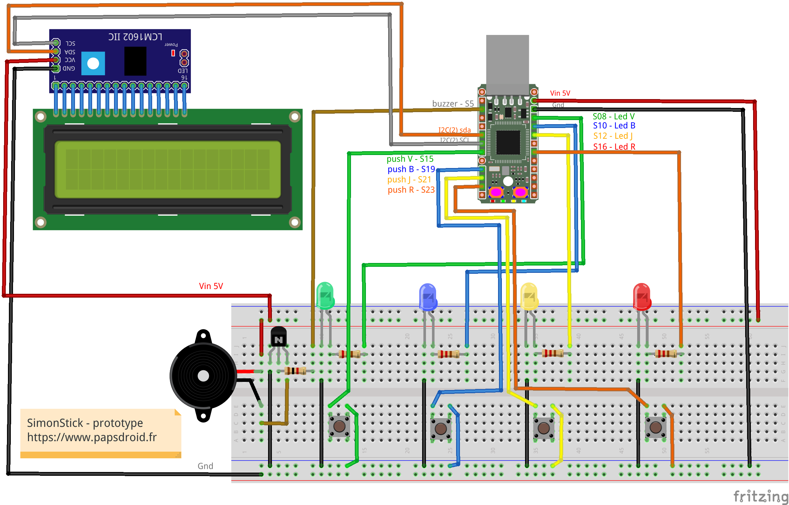
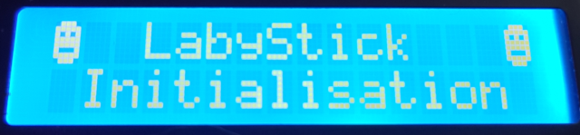
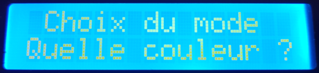
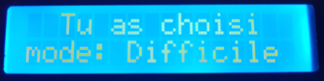
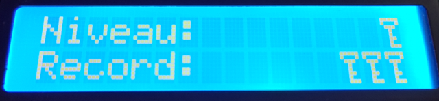
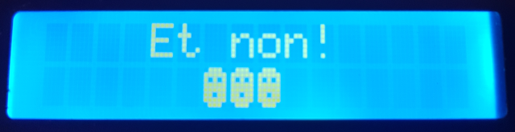

# SimonStick
Jeux de mémoire SIMON à base d'une PYBStick26: une série de plus en plus longue de couleurs (avec ou sans son) est générée et doit être reproduite à l'aide de boutons poussoirs.

## matériel nécessaire
* 1 PYBStick26
* 4 leds 5mm (Verte, Bleue, Jaune, Rouge)
* 4 résistances 220 ohms (pour les leds)
* 1 transistor npn (TO92)
* 1 résistance 1k ohms (pour le transistor)
* 1 petit buzzer passif
* 4 petits boutons poussoir 6mm
* 1 écran LCD 1602 avec backpack I2C

## prototypage sur breadboard

## scripts micropython à installer sur la PYBStick
Dans le répertoire PYBFLASH qui s'affiche à l'odinateur lors du branchement de la PYBStick sur un port USB, déposez tous les fichiers Micropython ci-dessous:
* buttons.py : gestion du rack de boutons poussoirs
* buzzer.py  : gestion du buzzer
* lcd.py     : gestion du LCD
* lcd2ic.py  : conçu par [MC Hobby](https://github.com/mchobby/pyboard-driver/tree/master/PYBStick): gestion du LCD via I2C de la PYBStick
* leds.py    : gestion du rack de leds
* main.py    : script principal 
* pwm.py     : conçu par [MC Hobby](https://github.com/mchobby/pyboard-driver/tree/master/PYBStick) : gestion des sorties PWM de la PYBStick

## synoptique du jeux
Un message d'accueil avec musique apparait, ainsi qu'une petite animation colorée des leds.

Le joeur est alors invité à choisir un mode de jeux:
* __Vert__ : facile, il s'agit du jeux SIMON classique où une séquence de leds de plus en plus longue avec son activé pour chaque couleur doit être devinée par le joeur
* __Bleu__ : moyen, idem que le mode vert mais sans les sons
* __Jaune__: difficile. Dans ce mode la séquence de leds est à chaque fois réinitialisée au hasard, avec les son activés.
* __Rouge__: expert. Idem mode Jaune mais sans les sons.

Le mode choisi est confirmé sur l'écran LCD

Le joueur est alors invité à :
* observer la séquence de leds (avec ou sans son, selon le mode choisi) qui s'allument
* reproduire la même séquence à l'aide du rack de boutons poussoir

S'il gagne: la led verte va clignoter 3 fois, le niveau est augmenté, et si le record du mode est battu il est aussi mis à jour.

S'il se trompe: une musique de la loose est jouée, la led rouge clignote 3 fois, et un message est indiqué sur l'écran. 
Le jeux retourne alors sur l'écran de choix du mode.

